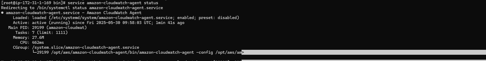

# 🛠️ AWS CloudWatch Agent Practical – Custom Metrics Monitoring

This practical demonstrates how to set up the **CloudWatch Agent** on an EC2 instance to push **custom system-level metrics** (memory, disk, etc.) to Amazon CloudWatch.

---

## 🧾 Project Overview

- Attach an IAM role to EC2 to allow CloudWatch metric publishing.
- Install and configure the **Amazon CloudWatch Agent** on a Linux EC2 instance.
- Use the **CloudWatch Agent Configuration Wizard** to generate a custom config file.
- Verify custom metrics appeared in CloudWatch.

---

## 🛠️ Services Used

- Amazon EC2           
- Amazon CloudWatch   
- IAM                
- CloudWatch Agent 

---

## ⚙️ Steps Performed

### 📸 Step 1: Attach IAM Role to Instance

Attached an IAM role to EC2 Instance with the **CloudWatchAgentServerPolicy** to allow metric publishing.

---

### 🖥️ Step 2: Install Required Packages

SSH into the EC2 instance and run the following commands:

#### Install collectd (optional plugin support)
sudo yum install collectd -y

#### Install CloudWatch Agent
sudo yum install amazon-cloudwatch-agent -y

#### OR Download the latest agent manually
wget https://amazoncloudwatch-agent.s3.amazonaws.com/amazon_linux/amd64/latest/amazon-cloudwatch-agent.rpm

---

### 🛠️ Step 3: Configure the Agent
Generate a configuration file using the interactive setup wizard:

cd /opt/aws/amazon-cloudwatch-agent/bin/
./amazon-cloudwatch-agent-config-wizard

#### The wizard will ask about:

- Log & metric collection
- Resource types (memory, disk, etc.)

---

### 🚀 Step 4: Start the Agent with Config

sudo /opt/aws/amazon-cloudwatch-agent/bin/amazon-cloudwatch-agent-ctl \
-a fetch-config -m ec2 -s -c file:/opt/aws/amazon-cloudwatch-agent/bin/config.json

#### This command:

- Fetches the config file
- Starts the agent
- Begins pushing metrics to CloudWatch

---

### 📸 Step 5: Confirm Agent is Running
Check the agent's status to ensure it's active.

---

### 📸 Step 6: Verify Agent Appears in Console
CloudWatch agent will appear as a new resource under custom namespaces ("CWAgent").

---

### 📸 Step 7: View Custom Metrics in CloudWatch
Metrics like memory and disk now appear in the CloudWatch metrics.

---

### ✅ Output
- CloudWatch Agent installed and configured.
- Custom metrics successfully pushed and visible in CloudWatch.
- Instance actively monitored with enhanced observability.

---

### 📂 Folder Structure

AWS-CloudWatch-Agent-Practical/

    ├── 01-Attach-CloudWatchAgent-IAM-Role-Instance.png
    ├── 02-CloudWatchAgent-Status-Active.png
    ├── 03-CWAgent-Appeared.png
    ├── 04-CloudWatch-Metrics-Appeared.png
    └── README.md
