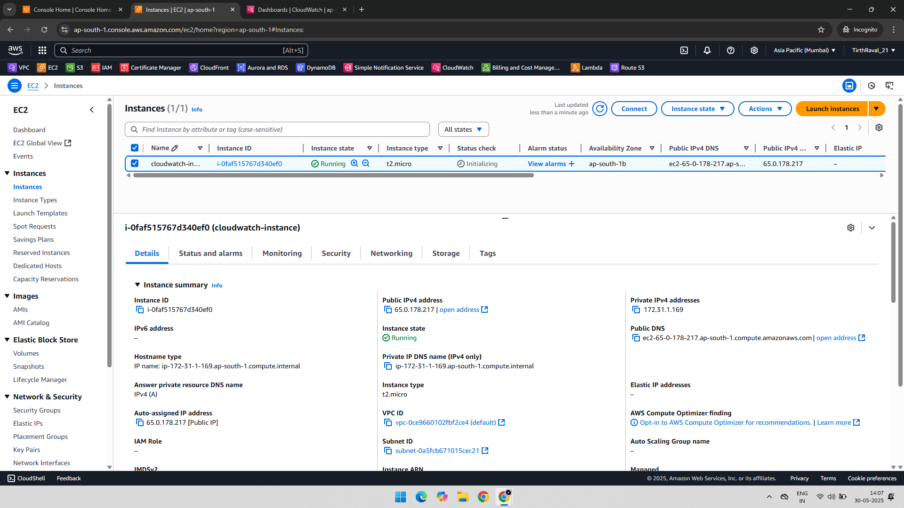
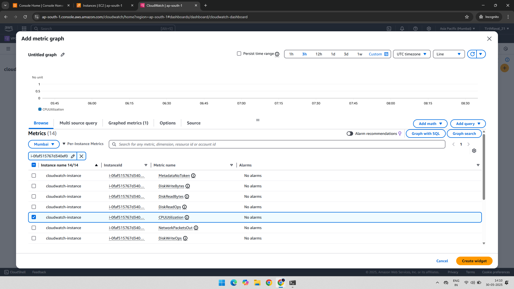
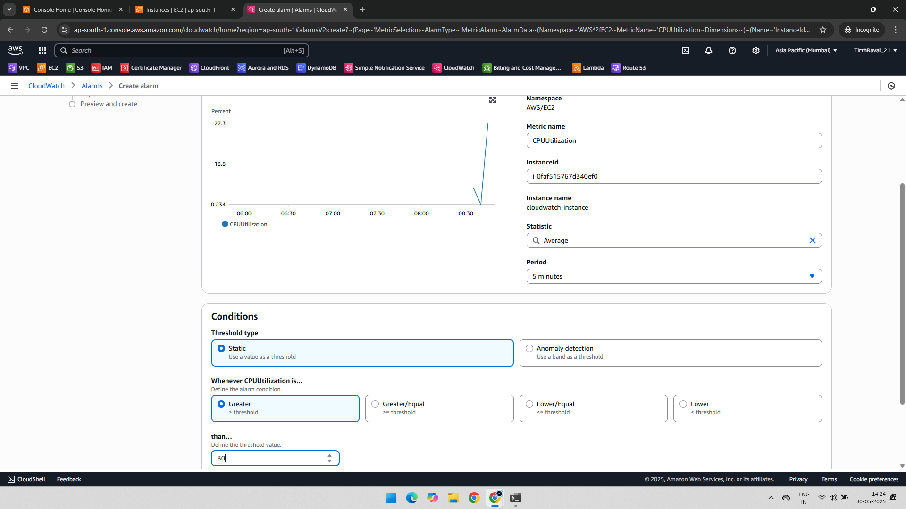
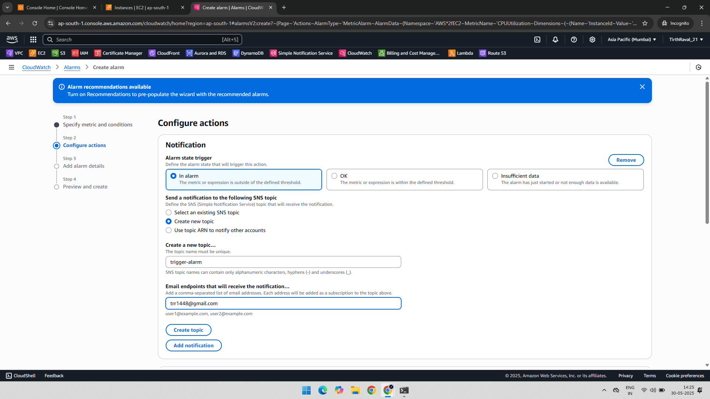
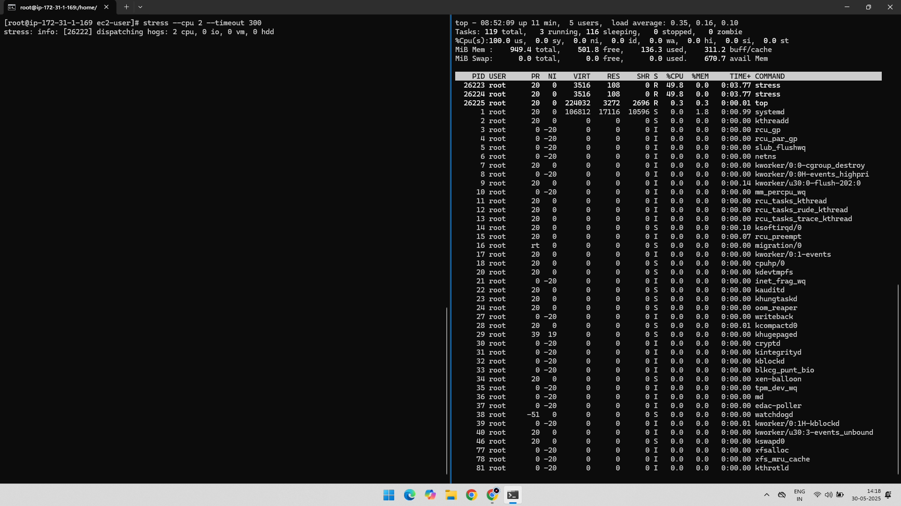
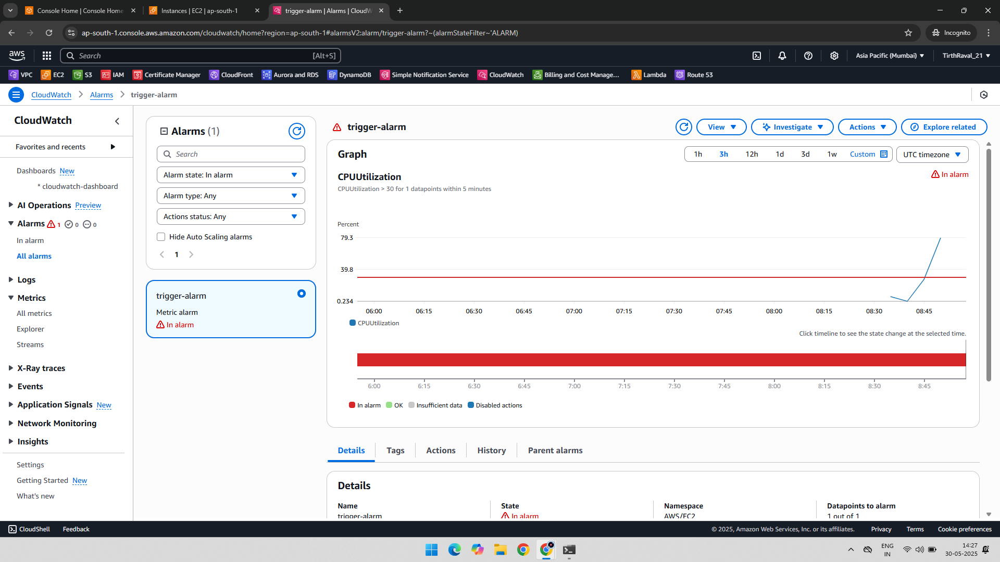
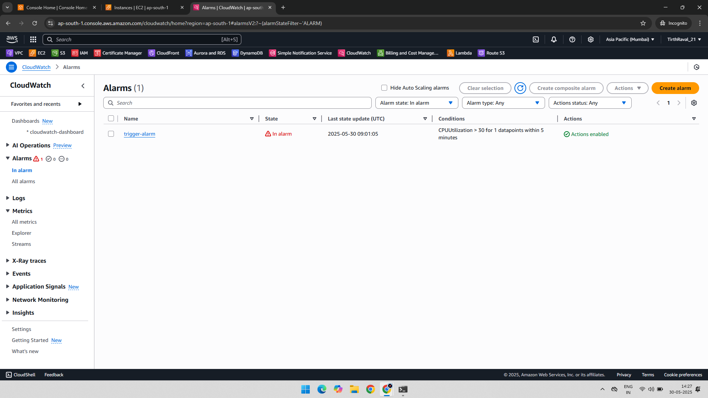
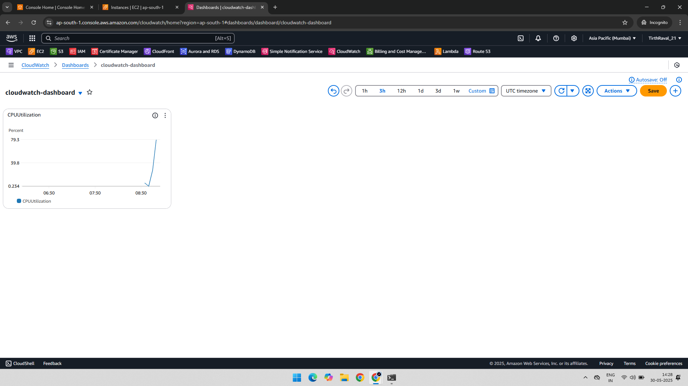
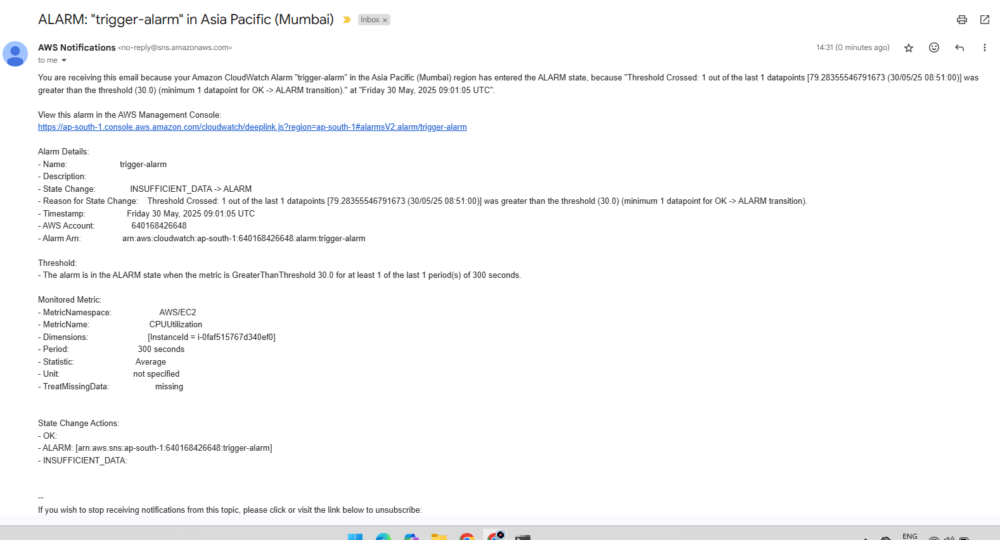

# 📊 AWS CloudWatch EC2 CPU Utilization Alarm with SNS Email Notification

### This project demonstrates how to monitor an EC2 instance's CPU utilization using AWS CloudWatch, configure alarms, and notify via SNS email when usage exceeds a threshold.
---

## 🧾 Project Overview

The goal of this practical is to:
- Monitor CPU Utilization of an EC2 instance
- Set up a CloudWatch Alarm
- Trigger notification using SNS when CPU exceeds threshold
- Test the alarm using a stress test

---

##📎Related AWS Services
- Amazon EC2
- Amazon CloudWatch
- Amazon SNS

---

## ⚙️ Steps Performed

### ✅ 1. Created EC2 Instance  
Created a new EC2 instance (Amazon Linux 2) with a key pair and security group allowing SSH.

---

### 📈 2. Selected CPU Utilization Metrics  
In CloudWatch, selected `CPUUtilization` metric for the running instance.

---

### ⏰ 3. Created Alarm  
Created a CloudWatch Alarm to trigger when CPU exceeds a certain threshold (e.g., 30%).

---

### 📩 4. Configured SNS and Set In Alarm State  
Created an SNS topic and subscribed with an email address to receive notifications.

---

### 🔥 5. Performed CPU Stress Test  
Logged into the EC2 instance and installed `stress` tool to simulate high CPU usage.

sudo yum install stress -y
stress --cpu 2 --timeout 120

---

🚨 6. Alarm Entered “In Alarm” State
Once the CPU crossed the threshold, the alarm changed to In Alarm state.

---

🟥 7. Alarm Trigger Notification
Alarm triggered and notification was sent to SNS topic subscribers.

---

📊 8. Graph on CloudWatch Dashboard
The graph on CloudWatch showed a spike in CPU usage during the stress period.

---

📧 9. Email Notification via SNS
Received an email from SNS confirming the alarm trigger.

---

✅ 10. Stress Over and Alarm Back to OK
After stress ended, the CPU usage dropped and the alarm returned to OK state.

---

✅ Final Output
-Successfully monitored EC2 CPU usage
-Alarm triggered on high usage
-Email notification received via SNS
-Verified via CloudWatch Dashboard and email inbox

---

📂 Folder Structure

AWS-CloudWatch-CPU-Alarm-Practical/
    ├── 01-Created-Instance.png
    ├── 02-Selected-CPUUtilization-Metrics.png
    ├── 03-Created-Alarm.png
    ├── 04-InAlarm-SNS-Configured.png
    ├── 05-Stress-In-Created-Instance.png
    ├── 06-Increase-CPU-Utilization-In-Alarm.png
    ├── 07-In-Alarm-Triggers.png
    ├── 08-CloudWatch-Dashboard-Graph-Increase.png
    ├── 09-Message-In-Email-SNS.png
    ├── 10-Stress-Over-Alarm-OK.png
    └── README.md
