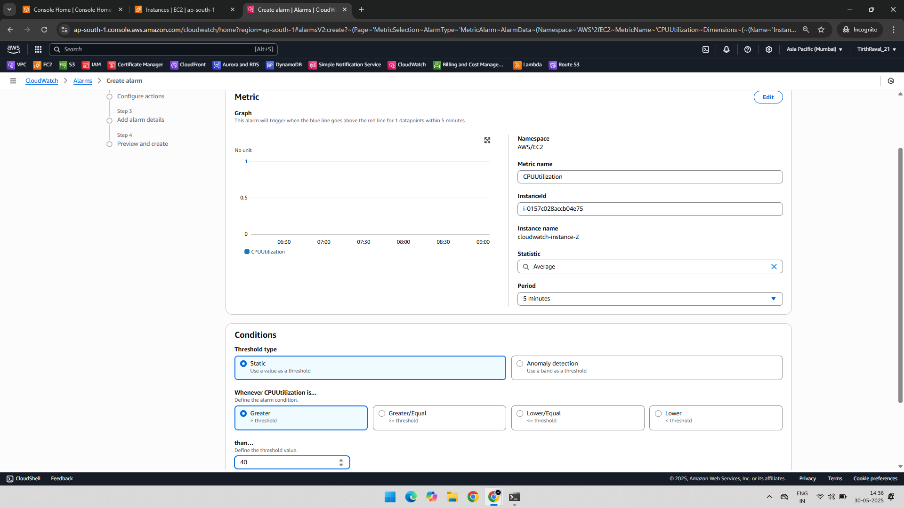
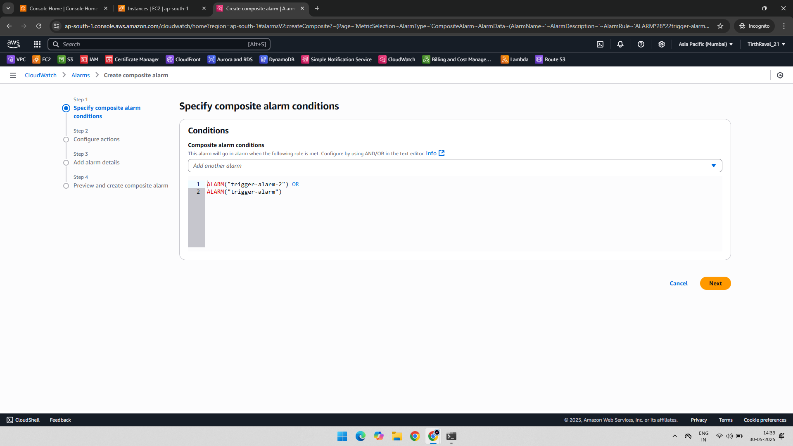
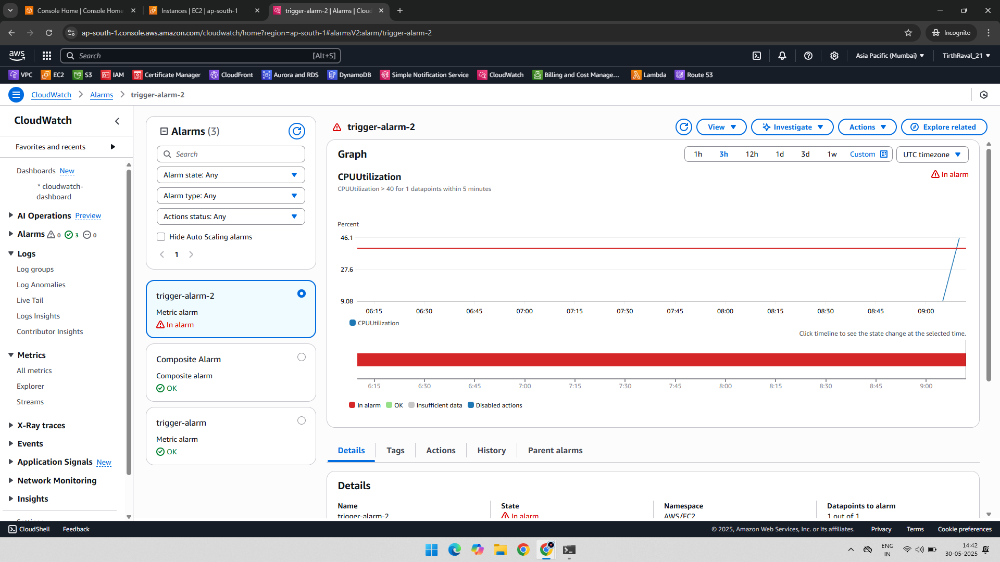
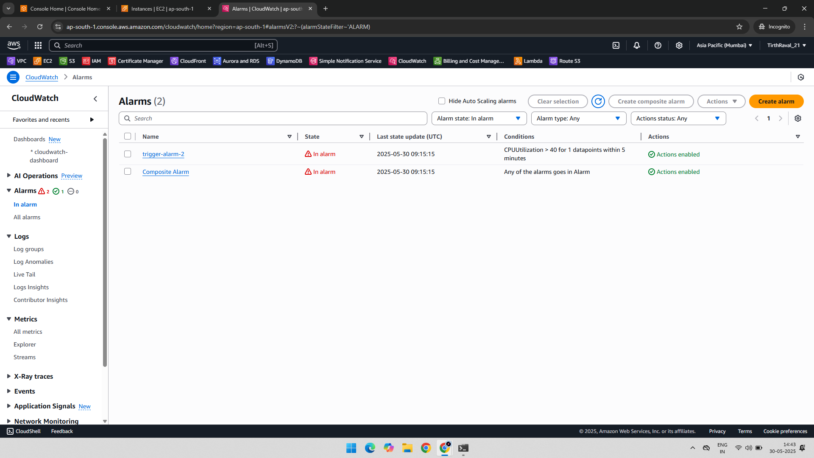
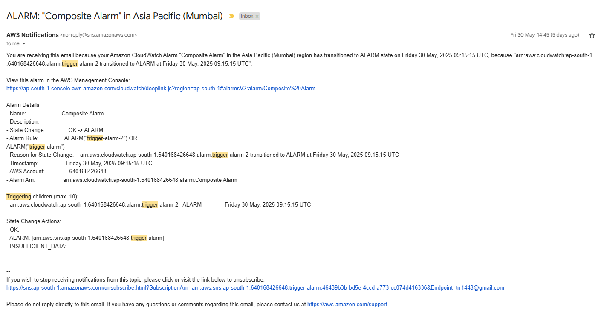

# 🧠 AWS CloudWatch Composite Alarm Practical

This practical demonstrates how to configure a **composite alarm** in Amazon CloudWatch. Composite alarms combine multiple individual alarms using logical conditions.

---

## 🧾 Project Overview

- Create two individual CPU utilization alarms.
- Stress the instance to trigger alarms.
- Combine them into one composite alarm.
- Observe the behavior when conditions are met.

---

## 📎 Related AWS Services
- Amazon EC2
- Amazon CloudWatch
- Amazon SNS

---

## ⚙️ Steps Performed

### ✅ Step 1: Created Another EC2 Instance and Alarm
A new Amazon EC2 instance and Alarm was created for testing.

---

### 💻 Step 2: Stress Test on Instance  
The `stress` command was run to artificially increase CPU utilization.

- sudo yum install stress -y
- stress --cpu 2 --timeout 120

---

### 📊 Step 3: Created Composite Alarm
A composite alarm was created in CloudWatch using two individual CPU alarms.

---

### 🔔 Step 4: 1 Out of 2 Alarms Trigger
One of the individual alarms triggered due to CPU threshold breach.

---

### 🧠 Step 5: Composite Alarm Triggers
The composite alarm logic was satisfied (1 of 2 alarms in In ALARM state), so the composite alarm triggered.

---

### 📧 Step 6: Email Notification for Composite Alarm (via SNS)
The Email Notification was received via SNS when the Composite Alarm goes "In Alarm" State.

---

### 📤 Final Output
- Two CloudWatch alarms were created and tested.
- Composite alarm triggered when any one of the alarms entered ALARM state.
- Behavior was verified using a simulated CPU spike.

---

### 📂 Folder Structure

AWS-CloudWatch-Composite-Alarm/

    ├── 01-Created-Another-Alarm.png
    ├── 02-Stress-In-Previously-Created-Another-Alarm.png
    ├── 03-Created-Composite-Alarm.png
    ├── 04-1outof2-Alarm-Triggers.png
    ├── 05-Composite-Alarm-Triggers.png
    ├── 06-Email-Notification-Composite-Alarm.png
    └── README.md
