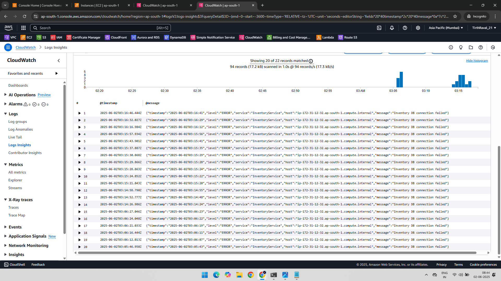
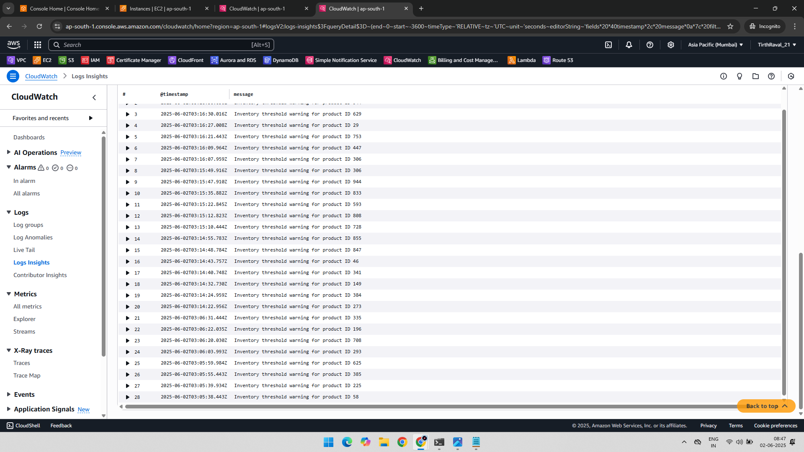
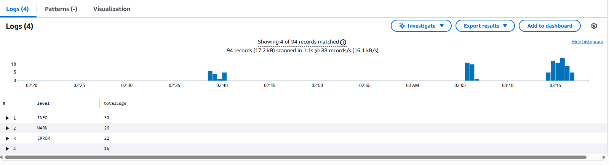
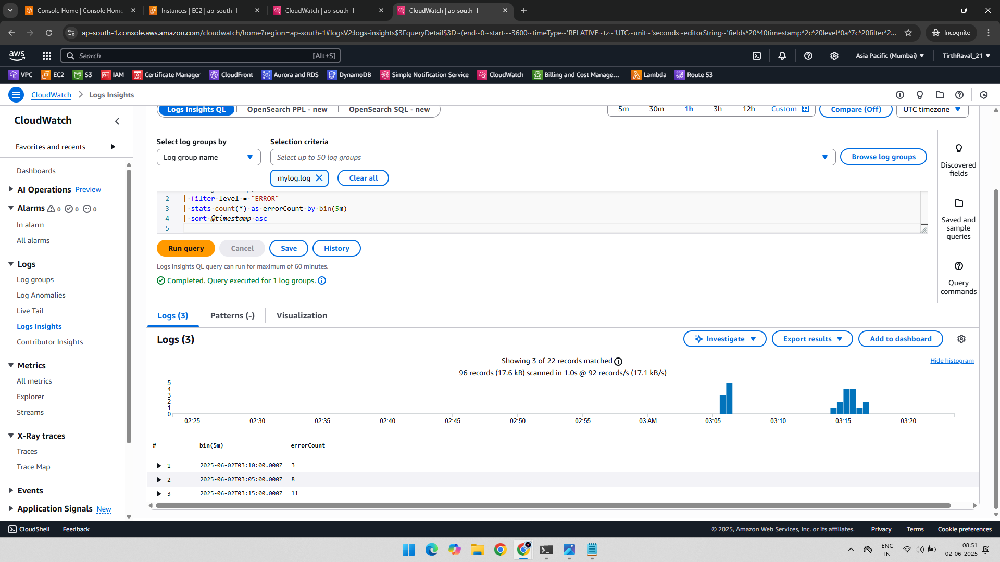

# 📊 AWS CloudWatch Log Insights - Practical Project

This project demonstrates how to use **CloudWatch Logs Insights** to analyze logs collected from EC2 using CloudWatch Agent. Each query targets a specific use case such as filtering error messages, searching for keywords, counting logs by level, and visualizing trends over time.

> 📝 Log data is generated by a custom shell script and continuously written to `/tmp/mylog.log`.

---

## 🧾 Project Overview

- Simulate real-time log generation on an EC2 instance
- Run queries in CloudWatch Logs Insights

---

## 🛠️ AWS Services Used

- Amazon EC2
- Amazon CloudWatch Logs
- CloudWatch Logs Insights

---

## 🔧 Log Insight Queries and Output

---

### 📌 Query 1: View Latest ERROR Logs

<pre><code> fields @timestamp, @message
| filter level = "ERROR"
| sort @timestamp desc
| limit 20 </code></pre>

### 🔍 Purpose:
- Filters logs with level "ERROR"
- Shows the most recent 20 entries

### 📷 Output 

---

### 📌 Query 2: Search for Keyword threshold in Log Messages

<pre><code> fields @timestamp, message
| filter message like /threshold/
| sort @timestamp desc </code></pre>

### 🔍 Purpose:
- Searches for any log messages that mention threshold
- Useful to catch threshold warnings from the application

### 📷 Output

---

### 📌 Query 3: Count Logs by Level (INFO, WARN, ERROR)

<pre><code> fields level
| stats count(*) as totalLogs by level
| sort totalLogs desc </code></pre>

### 🔍 Purpose:
- Aggregates total number of logs by level
- Gives a quick overview of how many INFO, WARN, and ERROR logs were recorded

### 📷 Output

---

### 📌 Query 4: ERROR Log Frequency Over Time (5-Min Bins)

<pre><code> fields @timestamp, level
| filter level = "ERROR"
| stats count(*) as errorCount by bin(5m)
| sort @timestamp asc   </code></pre>        

### 🔍 Purpose:
- Shows how frequently ERRORs occurred in 5-minute time windows
- Helpful for visualizing trends and identifying spikes

### 📷 Output           

    

---

### 📁 Folder Structure

AWS-CloudWatch-Logs-Insight-Practical/

    ├── 01-Query-1-Output.png
    ├── 02-Query-2-Output.png
    ├── 03-Query-3-Output.png
    ├── 04-Query-4-Output.png
    └── README.md
