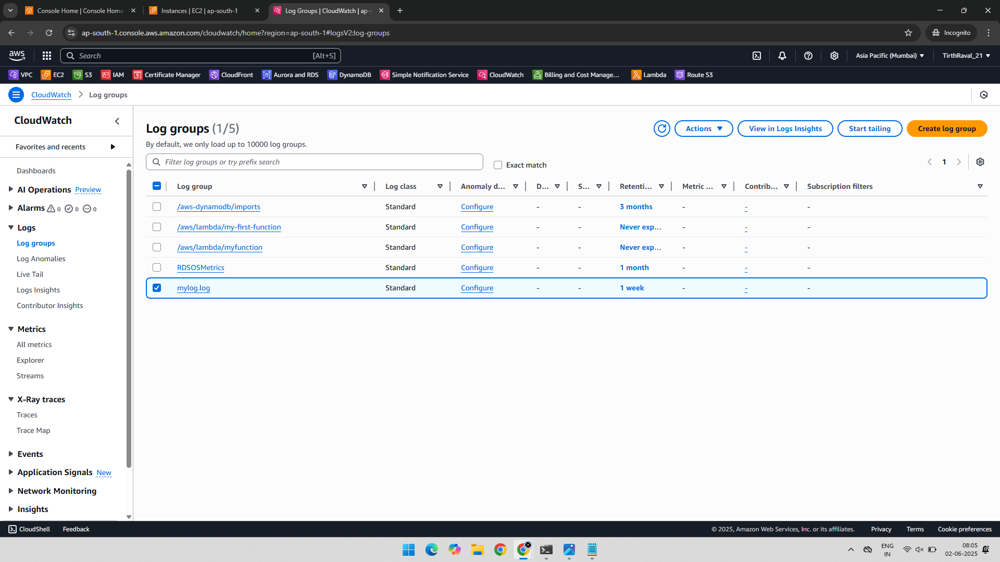
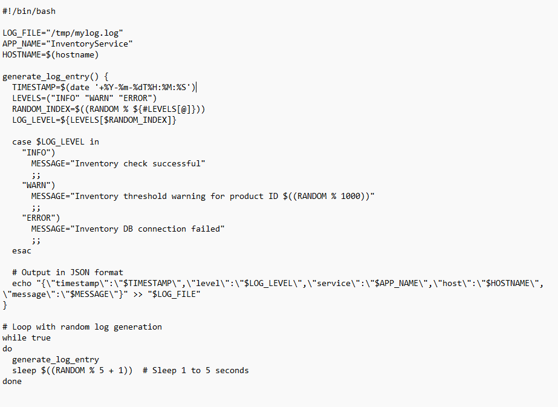
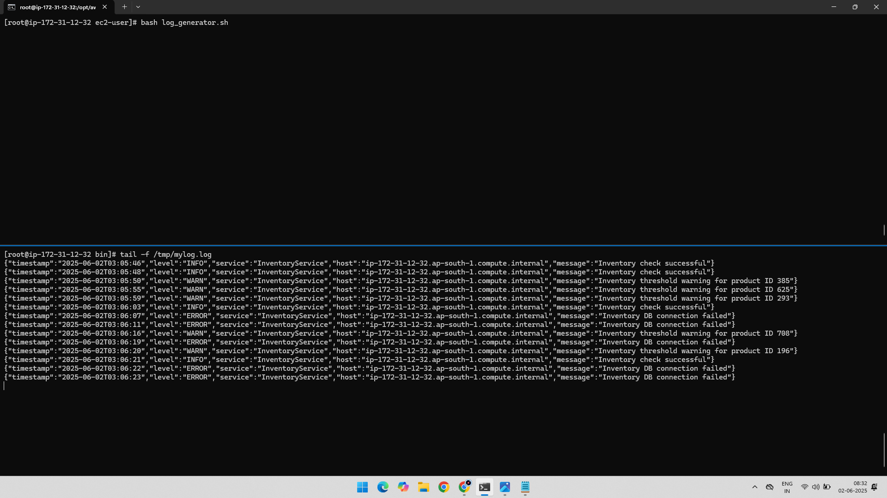
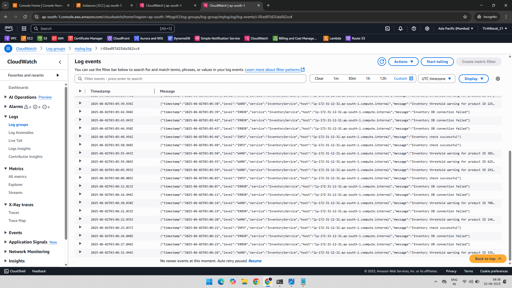

# 📊 AWS CloudWatch Logs Practical – Custom Log Group Monitoring

This project demonstrates how to create a CloudWatch Logs group, push custom logs from an EC2 instance, and verify the logs in the AWS Console.

---

## 🧾 Project Overview

- Create a new CloudWatch Logs group.
- Generate logs from an EC2 instance.
- Configure the agent and script to push logs to the log group.
- View and analyze the logs in the AWS Console.

---

## 🛠️ Services Used

- Amazon EC2
- Amazon CloudWatch Logs

---

## ⚙️ Steps Performed

### 📸 Step 1: Created a Log Group

Created a CloudWatch Logs group named `mylog.log`.

---

### 📸 Step 2: Generated Logs on EC2 Instance

SSH into the EC2 instance and created a custom log generator script to simulate real-time application logs in JSON format. Logs are written to `/tmp/mylog.log`. Previously Created in CloudWatch Agent and given path.

📄 The above script continuously generates logs in JSON format, mimicking a real-world application and writes them to /tmp/mylog.log.

---

### 📸 Step 3: Verified Logs in Log Group
The generated logs appeared in the created CloudWatch Log Group.

---

### ✅ Output
- Log group mylog.log successfully created.
- Logs generated and pushed from EC2 instance.
- Log entries are visible and searchable in the AWS CloudWatch Logs Console.

---

### 📂 Folder Structure

AWS-CloudWatch-Logs-Practical/

    ├── 01-Log-Group-Created.png
    ├── 02-Logs-Generated.png
    ├── 03-Generated-Logs-Seen-In-Log-Group.png
    └── README.md

